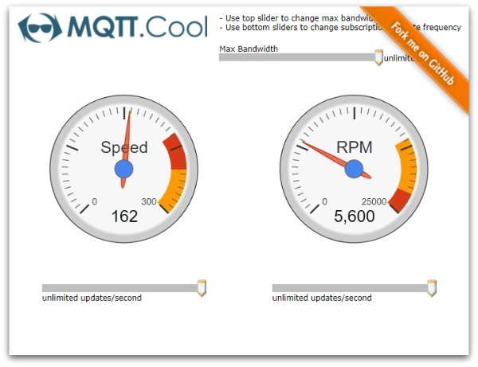

# MQTT.cool - Hello IoT World Demo - HTML Client

The **Hello IoT World Demo** is a simple real-time telemetry application based
on MQTT.cool.



## Details

The **Hello IoT World Demo** uses the *MQTT.cool Web Client API* to show how
MQTT.cool can be used to send real-time telemetry data through the Web and, very
important, how incoming update flow can be further manipulated in terms of
bandwidth and frequency management.

In this demo, the Web page submits two MQTT subscriptions to two separate
topics, in order to receive real-time telemetry metrics of a hypothetical car,
such as Speed and Engine RPM. Upon receiving, data message is displayed by the
pertinent graphical gauge.

Real-time telemetry updates are delivered by a random feed simulator, which is a
simple Node.js application that connects to a MQTT broker, generates simulated
data and publishes them to the target topics at a fixed interval (100 ms).

The demo shows how MQTT.cool enables an *end-to-end* connection between the Web
page and the MQTT broker, as it takes the role of real MQTT server proxy by
acting as an intermediary for requests coming form the client and targeted to
the broker (in this case, the subscriptions to telemetry topics), as well as
for responses (subscription acks) and Application Messages (telemetry data)
coming from the broker and directed to the client.

Use the Max Bandwidth slider to dynamically change the maximum bandwidth granted
for the current session. Upon moving the slider, the new bandwidth will be
notified by the client to MQTT.cool, which in turn will change the update
frequency on the fly, to respect the bandwidth limit. You can see that with a
bandwidth as ridiculous as 0.5 kilobits per seconds, MQTT.cool is still able to
deliver updates to the page, thanks to the very optimized network protocol used.

Use the Max Frequency slider to dynamically change the maximum update rate of
incoming messages relative to a single subscription. The client will renew the
subscription asking for the new frequency limit and MQTT.cool will change the
update frequency on the fly, to respect the frequency limit.

You can see how the bandwidth and frequency constraints act on different levels.
The bandwidth constraint is applied to the whole session, that is, to the global
update flow for this page. On the other hand, the frequency constraint is
applied to each MQTT subscription individually. Both the constraints set an
upper bound, which is dynamically managed by MQTT.cool. Note that the updates
are not queued and delayed, but resampled and conflated. In other words, when a
subscription has a chance to be updated (based on a round-robin algorithm), it
will receive the very latest available message, not an old one.

## Install

If you want to install a version of this demo pointing to your local MQTT.cool,
follows these steps.

* As prerequisite, this demo needs a MQTT infrastructure to run. You can choose
whatever MQTT broker you prefer, or may also use one of the available public
broker (an update-to-date list is maintainer at
[https://github.com/mqtt/mqtt.github.io/wiki/public_brokers]()).
* Configure the MQTT.cool instance. Please refer to Lightstreamer
web site [download page](http://download.lightstreamer.com/) to find the
MQTT.cool download package. MQTT.cool comes with a set of predefined
configurations for connecting with local MQTT server instances, as well as with
the most common publicly accessible brokers. If you want to provide a new custom
configuration, open the `mqtt_master_connector_conf.xml` file located under
`<MQTT.COOL_HOME>/mqtt_connectors` and provide a set of entries similar to the
following (please refer to the inline documentation for more in-depth
information on how to configure broker connection parameters):

  ```xml
  ...
  <!-- MQTT broker connection parameters for a local instance
       listening on port 1883, aliased by "mybroker". -->
  <param name="mybroker.server_address">tcp://localhost:1883</param>
  <param name="mybroker.connection_timeout">5</param>
  <param name="mybroker.keep_alive">20</param>
  ...
  ```

* Launch the MQTT.cool server.
* Download this project.
* RequireJS is currently hot-linked in the html page: you may want to replace it
with a local version and/or to upgrade its version.
* jQuery is currently hot-linked in the html page: you may want to replace it
with a local version and/or to upgrade its version.
* Deploy this demo on MQTT.cool (used as Web server) or in any external Web
server. If you choose the former, create a folder with name such as
`Hello_IoT_World` under the `<MQTT.COOL_HOME>/pages`, and copy there the
contents of the `src/web` folder of this project.
* If required, install Node.js
* From `src/feed` folder, get the [MQTT.js](https://github.com/mqttjs/MQTT.js)
client library, which is required by the feed simulator application:

 ```
 npm install mqtt
 ```

## Configure

The demo assumes that MQTT.cool is launched from localhost, but if you need to
target a different server, search in `web/js/index.js` this line:
```js
MQTTCool.connect('http://localhost:8080', {
```
and change it accordingly.

Further, the demo will look for the **mosquitto** alias, which is predefined in
the default MQTT.cool configuration. Once more, if you need to target a
different MQTT broker, and provided that relative connection parameters are
already defined as shown above, modify the following line in `web/js/index.js`:

```js
  mqttClient = mqttCoolSession.createClient('mosquitto');
```
and change it by replacing **mosquitto** with new alias that maps the MQTT
broker you are going to use.

## Launch

Open your browser and point it to [http://localhost:8080/Hello_IoT_World](), or
to the address according to the host and/or the name of the folder where you
deployed the project.

From the `feed` folder, run the feed simulator application to publish simulated
telemetry metrics:
```
node generate.js
```

and immediately the gauges reflect updates according to the received real-time
metrics.

## See Also

<!-- START RELATED_ENTRIES -->

* [MQTT.cool - Basic Chat Demo - HTL Clienet](https://github.com/Lightstreamer/MQTT.cool-example-Chat-client-javascript)

### Related Projects

* [Lightstreamer - Race Telemetry Demo - HTML Client](https://github.com/Lightstreamer/Lightstreamer-example-RaceTelemetry-client-javascript)

<!-- END RELATED_ENTRIES -->

## MQTT.cool Compatibility Notes

* Compatible with MQTT.cool Web Client SDK version 1.0 or
newer.
* Compatible with MQTT.cool since version 1.0 or newer.

